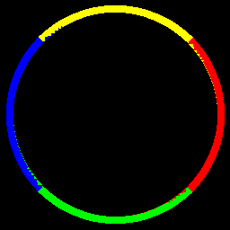

# Assignment 2

Minh-Triet Diep, Lars Jaeqx

## Canny Edge

## Sobel Gradient
We first load the circle and convert it to a grayscale. This is the input image:

We then  try to create a hard edge by filtering pixels on brightness. Greater than 127 we'll just determine as white, otherwise it's black. This is the result:

To achieve a single edge, we'll fill the circle with white. Because of step 0, the edges are hard, so the fill function works without problems. The result:

If we were to finish now we'd detect a 1px transition edge and it'd work. But since this doesn't look as pretty, we blur the filled image again. This makes the transition area bigger so we have more pixels to work with and fill:

Finally we run the sobel filter to get the gradients of the transition areas. For each pixel we have the dy and dx. This is used in an inverse tangent function to determine the angle. A problem this function gives is that it returns an angle between -pi and pi, and if we convert to degrees, these negative numbers are nonsense. We can just add 360 degrees however, and the values are after the 180 degrees part. This we can work with, a full 360 degree circle.

We then fill the results from here with the colors specified by the document:

|Degrees    | Color  |
|-----------|--------|
|1 to 45    | Red    |
|46 to 135  | Yellow |
|136 to 225 | Blue   |
|226 to 315 | Green  |
|316 to 359 | Red    |

We cheated a bit, because 0 is an angle too. For the white area without transitions, the inverse tangent is 0 here, but the dy and dx are both 0 too. For the vertical section on the left however, the inverse tangent is still 0, but we know dy is 0 and dx is not 0! So for this area we'll also draw red, as it's between 359 and 1. This will result in a complete circle!

We can notice some artifacts though. The inside shows some blocks where the angle is near the transition points. With smaller blur values, this is more of a line, and with bigger blur values, this becames more of a small line on the inside of the circle. We think this is due to the difference between dx and dy isn't clear-cut near these angles.

