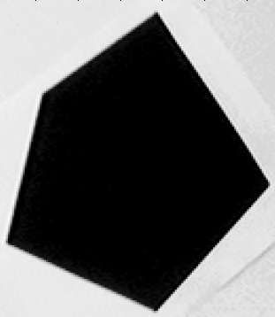
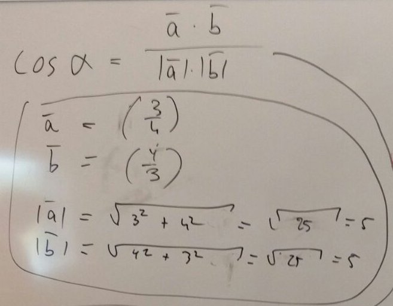
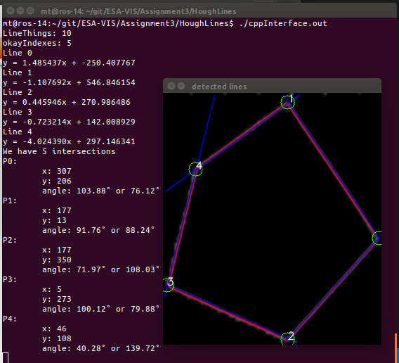
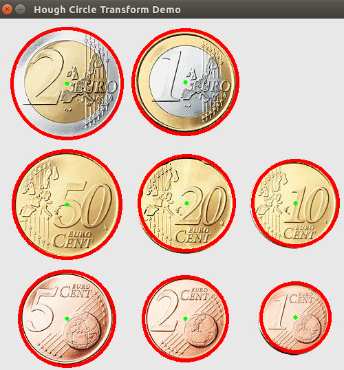
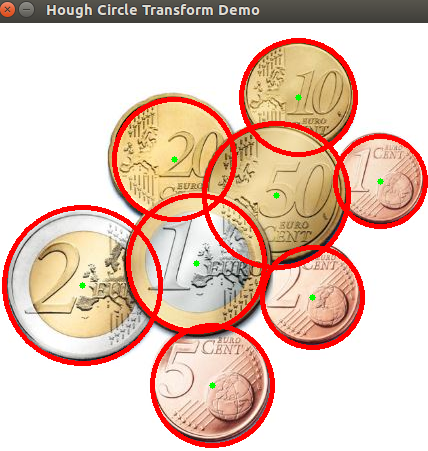

# Assignment 3  
Lars Jaeqx, Minh-Triet Diep

## Hough Lines  

The goal of this assignment is to detect lines and to calculate the angles for these lines.

The image we received:



To get the lines, we used Canny, cvtColor and a Gaussian Blur before we run HoughLinesP. We chose this over the regular HoughLines because it gave better results. We used the following parameters:

```cpp
HoughLinesP(dst, lines, 1, CV_PI/180.0, 50, 50, 10 );
```

`HoughLinesP` puts an array of two points in `lines`. These points are used to fill in the line formula `y = a*x + b` to find out a and b. These are our lines, and we save these results to a new array.

From the results we noticed this did detect the lines, but some lines were double, so we ran a function to see if the gradient/slope (a) and y-offset (b) are somewhat equal, to eliminate double lines.

From these valid lines, we get the intersections with the edges of the window, in order to have points to draw them later, and to be able to use these lines (as vectors) to calculate the angles between the intersections in the image.

We use the dot product of two vectors to calculate the angle, at the same time we save the intersections. The intersections we calculate simply by filling in `y=ax+b` with the coordinates we already had from earlier steps.



Finally, these results are printed in the terminal and drawn on the image:

  
Please note that the `0` label for `P0` is outside the image. We tried to correct this by using OpenCV functions to calculate the width of strings, but it didn't work out.

As you can see, we print both angles of the intersections. We did this because we figured we couldn't easily determine which angle was the asked angle, and especially with other kinds of figures with acute angles or reflex angles.

## Euros

For this part of the assignment we need to detect the circles of the Euro coins on the provided images. We used HoughCircles method to retreive the center and the radius of the circle. 

```cpp
HoughCircles( src_gray, circles, CV_HOUGH_GRADIENT, 1, src_gray.rows/8, 200, 30, 30, 0);
```

The [tutorial](https://docs.opencv.org/2.4/doc/tutorials/imgproc/imgtrans/hough_circle/hough_circle.html) provided in the assignment needed a little tweaking to work on the Euro images. We needed to change the kernel size of the blur and in the HoughCircle we changed the upper threshold for the internal Canny edge detector to 200, the threshold for center detection to 30 and the minimum radius to be detected to 30 pixels.  
  
On the images below you can see the result of the circle detection.
  

