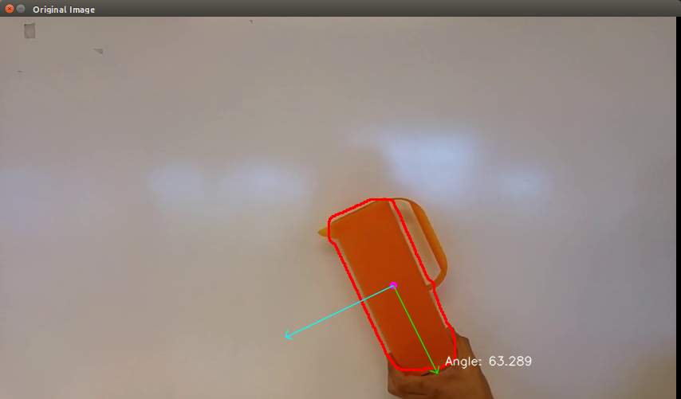
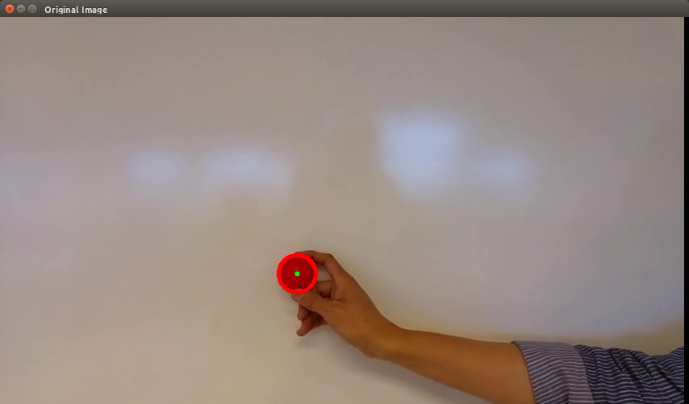

# Assignment 4  
Lars Jaeqx, Minh-Triet Diep

We used the provided source code example for object detection in all assignments below.

## Measuring Angle  

The goal of this assignment is to detect a rectangular object and calculate its angle.

We received a video of a red jug being held and rotated in front of a white board, and a source code file for object detection. We used this file as base for this part of the assignment. We found an [OpenCV example on how to calculate the angle of an object, using PCA.](https://docs.opencv.org/trunk/d1/dee/tutorial_introduction_to_pca.html). We also used this.

We converted the images to the HSV color space, so we could filter in range of hue, saturation, and brightness. This is better than RGB-based filtering for images with changing brightness. 

This image is fed to `findContours`, which data is then used in finding the orientation with the function from the example.

After applying angle detection, we saw the center point jumping around. This is due to the jugs handle being sometimes detected, so the COG moves around. We applied some erosion, gaussian blur and dilation to get the image detection more solid, which worked well. 
  

## Single Color

For the single-color detection, we used the code supplied by the assignment. We changed the live video feed to the provided movie. The first problem we encountered was if the video ended the program crashes. This is solved by setting the video back to the first frame if the video ends.   
  
Now we got the application running, we can play with the parameters using the trackbars. We found the best parameters for the red, yellow and blue ball which are usefull for the next assignment.  
  

## Multiple Color

The multiple-color detection is almost the same as the single-color detection, we just have to execute this three times, for every color one time. We hardcoded the values we found in the single-color detection.  
  

