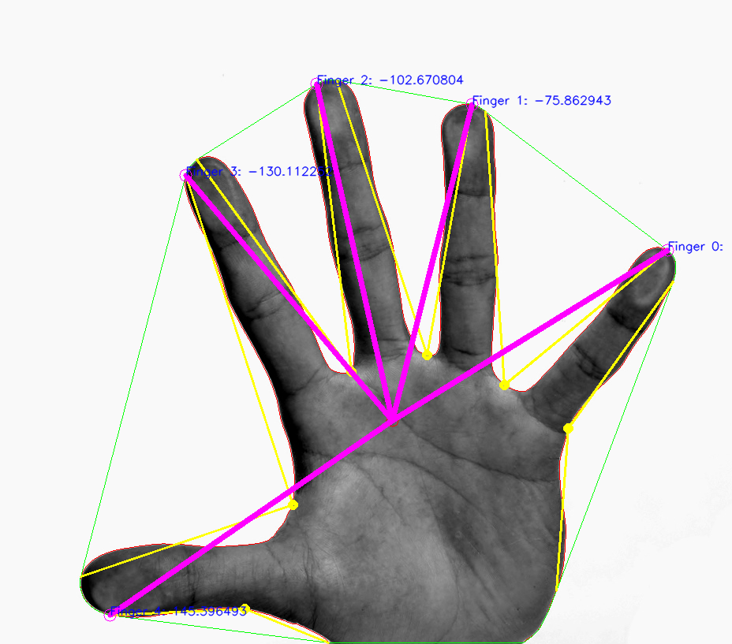

# Assignment 5

Lars Jaeqx, Minh-Triet Diep

## Identifying a hand

As with the previous assignments, we start out with converting the image to HSV color space. This is then blurred, after which we check if the color we want is in range. 

Since the background is entirely white, we can just filter everything that isn't the background quite easily. On that result, we do `cv::findContours`. This makes a vector of points which then can be used to determine the convex hulls and the defects. This gives us points of the fingertips and defects. 

Using `cv::moments` on the contours we can calculate the center of gravity of the hand. From here we can draw lines to the fingers, and label the fingers.

This is the final result:

