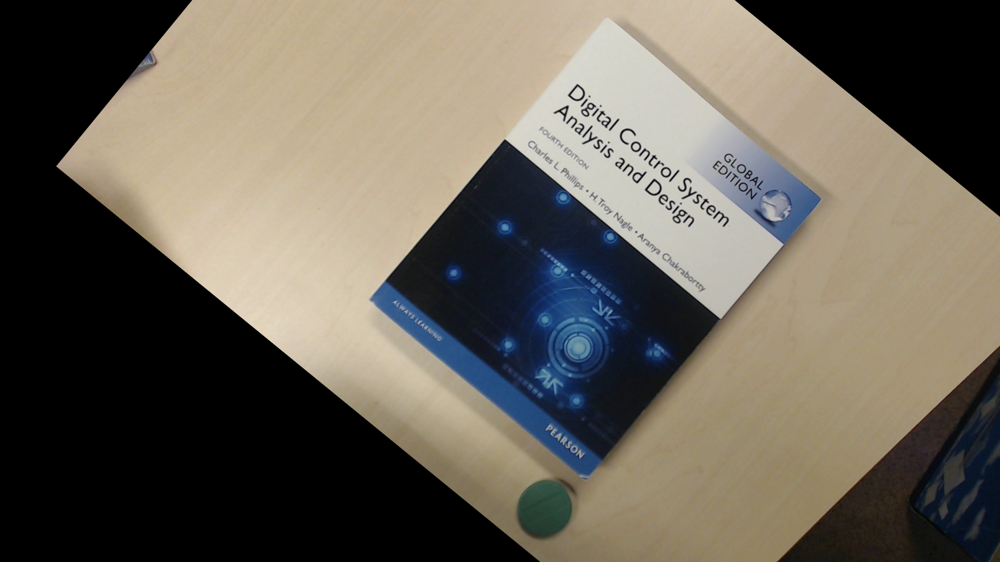

# Assignment 6

Lars Jaeqx, Minh-Triet Diep

## Transformation matrices

We first started out with detecting the corners of the book. This was done by filtering the image and selecting objects with a large enough aspect ratio. Then used contours and convex hull to get points around the book. We filtered for 4 points and this was the book.

Then we manually implemented the matrix operations:

* Transpose
* Determinant
* Minor
* Cofactor
* Inverse matrix

With the Cofactor we can currently process a 3x3 matrix, so this also limits the inverse matrix operating to the same size. This is why we finally used OpenCV's `invert` operation.

We plugged in our from the detected book points to get the transformation matrix in `getTransformationMatrix`, which returned the four values needed to build the final transformation matrix.

We apply this matrix with `warpPerspective` to get a final result.

 
 
 
 
 
 

-------------------

OpenCV result:

Our result:

