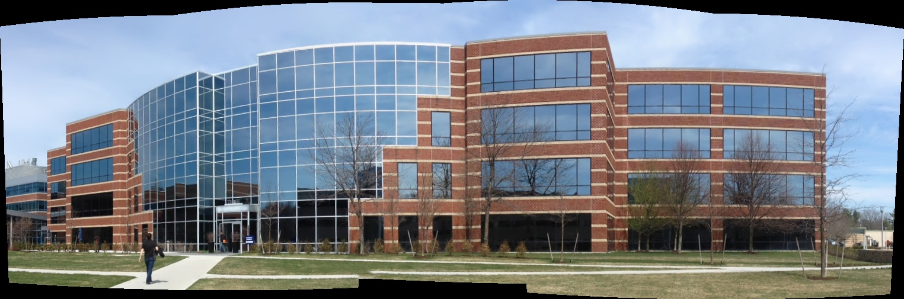

# Assignment 10

Lars Jaeqx, Minh-Triet Diep

## Image stitching

To stitch images we use the OpenCV `Stitcher` class. We have to set the parameters mode to `Stitcher::PANORAMA` and we can use the `try_use_gpu` if we want to. Next we call `stitcher->stitch(imgs, mat)` which will create the panorama image.

The result:  

The code has some extra functions which will print the usage of the parameters and parse the arguments, this is an extra feature and is not required for the stitching part. 